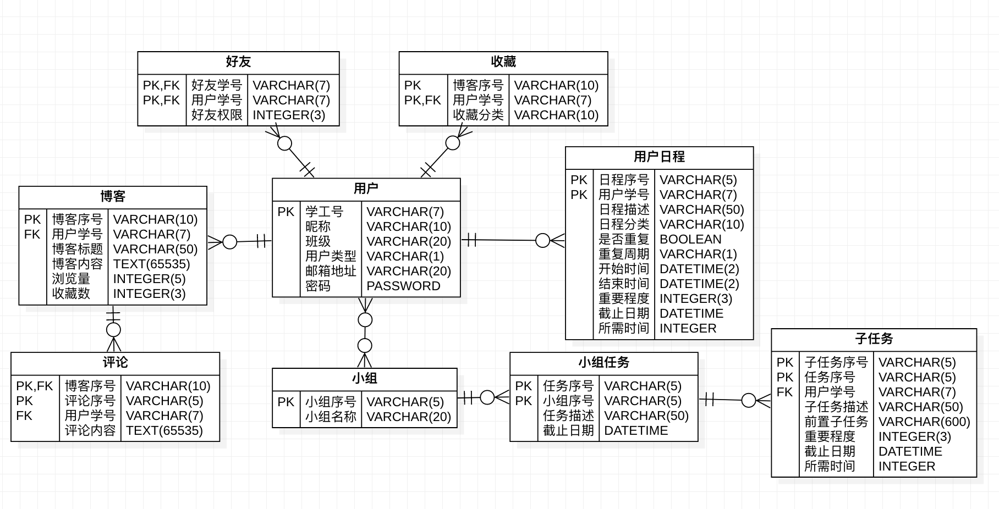
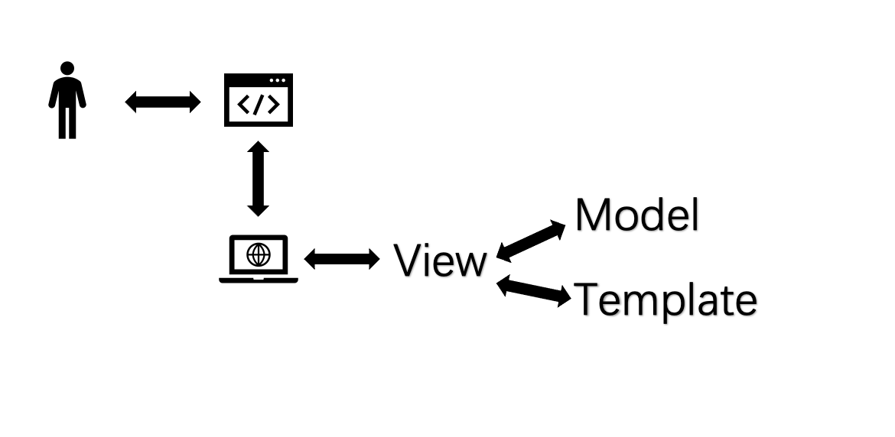

# 同济大学19级信管Web实践——学习助手

[TOC]

该项目的GitHub地址为：[https://github.com/Feng-Yz/Study-Helper](https://github.com/Feng-Yz/Study-Helper)

或：[https://github.com/Weber-LiWb/AI-Study-Helper](https://github.com/Weber-LiWb/AI-Study-Helper)

通过IP地址可以访问该项目网站：[http://47.103.73.100](http://47.103.73.100)

## 1 功能设计

### 1.1 项目背景

如今，随着高等教育改革和“双一流”学校建设持续推进，大学生面对更高的课程考核要求，更多的实践学习项目和更频繁的团队合作。这样的现状要求大学生具有更强的时间管理能力、规划能力和团队协调能力。与此同时，大学学习有很大一部分需要学生发挥主观能动性自行探索。然而，在现实中普遍存在同学们有问题但却羞于问出口的情况；而同学们收集的学习资料、整理的学习心得也没有机会在同学间交流，形成了一个原子化的隔离状态，失去了共同学习的机会。基于此，我们目标开发一套具有日程管理、小组分工、匿名博客功能在内的校园学习社交平台——”济忆校园“。

在济忆校园网站，同学们可以通过添加DDL（Deadline）到日程规划中对未来时间的分配有清晰的规划。可以在每日日程中标记今天的各项学习生活日程完成情况；可以创建小组，建立小组任务，并将小组任务分解为子任务进行分配，分配到组员中的任务将自动进入组员的日程规划；可以发表博客，发表评论，选择向自己的朋友公开自己在博客中的身份。这样，同学们就可以借助日程、小组等功能合理规划学习与日常生活，可以通过匿名博客提出学习疑问、分享学习心得、或者简单分享今天的心情。在济忆校园，同学们可以收获明晰的时间管理，也可以收获一个共同学习的秘密花园。济忆校园为同学们提供了科学规划时间，互助共同学习的功能，让学习在”内卷时代“回归学习本质。

### 1.2 网站功能

经过讨论，网站的功能分为基本模块、博客模块、日程模块与小组模块四个部分，每个初步设计的功能如下：

基本模块：注册、登录、修改密码、申请添加好友、通过好友申请、删除好友；

博客模块：发表博客、更改博客、删除博客、按页查看平台所有博客、按好友查看好友博客、发表评论、删除评论、收藏博客；

日程模块：查询日程、添加日程、完成确认；

小组模块：新建小组、查询小组、加入小组、添加小组任务、分配小组任务、分配任务添加至个人日程。

## 2 数据库设计

根据功能需求，抽象出以下实体以及实体之间的联系，绘制出ER图：

在本项目中，利用Django的对象关系映射（ORM）模块，使用类和对象对数据库进行操作。具体来说，也就是Django的MVT模式中的模型（Model），模型准确且唯一的描述了数据。它包含储存的数据的重要字段和行为。一般来说，每一个模型都映射一张数据库表。每个模型都是一个Python的类，这些类继承`django.db.models.Model`，模型类的每个属性都相当于一个数据库的字段。

对于该网站的实体、联系以及实体中各字段的说明如下：

### 2.1 用户（User，Profile）

学/工号（username）：由于系统服务于同济师生，该字段为最长为7个字符的字符串；

邮箱地址（email）：用户的邮箱地址，用于登录；

密码（password）：用户的密码，Django实现密码的哈希加密；

姓名/昵称（name）：用户自定义的昵称，最大长度为10个字符；

性别（gender）：用户的性别，包括M（男性）与F（女性）；

用户类型（type）：包括S（学生）与T（教师）；

班级（class_name）：用户所在的班级名称或院系，允许空。

值得注意的是，Django中有现成User类，只需要`from django.contrib.auth.models import User`。该类中，有属性`id`作为主键，且每个用户具有唯一的属性`username`，故将该属性作为学/工号。另外，对于Django自带的User类中未提供的字段，我们采取新建Profile类、将其和User建立一对一关系的方法实现。

### 2.2 小组（Group）

小组序号（id）：小组的序号，是Django自建的主键；

小组名称（group_name）：小组的名称，最大长度为20个字符；

小组种类（type）：小组的种类，最大长度为20个字符；

组长（leader）：小组的组长，以用户（User）为外键。

小组与用户是多对多的关系，即一个用户可以在多个小组，一个小组可以有多个用户。Django在根据定义的类进行建表时，会建立一张存储小组与成员关系的表。

### 2.3 用户日程（Schedule）

日程序号（id）：日程的序号；

日程描述（description）：对于日程的描述，最大长度为50个字符；

日程类型（type）：日程类型，例如学习类、运动类等，最大长度为5个字符；

是否重复（is_repeated）：日程是否需要按周期重复，例如每天、每周、每月；

重复周期（repeat_cycle）：包括D（每天）、W（每周）与M（每月）， 允许空；

开始时间（start_time）、截止日期（deadline）：日程的开始时间和截止日期；

权重（weight）：日程的重要程度；

预计所需时间（expected_minutes_consumed）：预计完成该日程需要花费的时间，以分钟为单位，允许空；

是否完成（is_done）：布尔类型，该日程是否完成。

用户与用户日程是一对多的关系，因此添加属性用户（user）。

### 2.4 小组任务（GroupAssignment）

任务序号（id）：任务的序号；

任务描述（description）：对于任务的描述；

截止日期（deadline）：任务的截止日期。

小组与小组任务是一对多的关系，因此添加属性小组（group）。

### 2.5 子任务（SubAssignment）

子任务是对小组任务的分解，将小组任务分解给每位小组成员。

子任务序号（id）：作业的序号；

前置子任务（pre_sub_assignment）：为了完成该任务所需要的前置子任务，字符串类型；

用户（user）：负责完成该任务的小组成员；

任务描述（description）：对于子任务的描述；

截止日期（deadline）：子任务的截止日期；

权重（weight）：子任务的重要程度；

预计所需时间（expected_minutes_consumed）：预计完成该子任务需要花费的时间，以分钟为单位，允许空。

任务与子任务是一对多的关系，因此添加属性任务（assignment）。

### 2.6 博客（Blog）

博客序号（id）：博客的序号，是Django自建的主键；

用户（user）：博客的作者；

标题（title）：博客的标题，最大长度为50个字符；

内容（content）、浏览量（pageview）、收藏量（collect_amount）、创建时间（created_time）、修改时间（modified_time）：博客的内容、浏览量、收藏量、创建时间与修改时间。

### 2.7 评论（Comment）

评论序号（id）：评论的序号；

用户（user）：评论博客的用户；

内容（content）：评论的内容；

创建时间（created_time）：评论的创建时间。

博客与评论是一对多的关系，因此添加属性博客（blog）。

### 2.8 好友（Friend）

用户（user）、好友（friend）：用户以及其好友；

权限（authority）：以整数存储，表示用户开放给好友的查看权限。

用户与好友作为共同主键。

### 2.9 收藏（Collection）

用户（user）、博客（blog）：用户以及其收藏的博客；

种类（type）：收藏的种类。

用户与博客作为共同主键。

### 2.10 完成日程（FinishedSchedule）

序号（id）：该完成日程的序号；

完成时间（finish_time）：完成日程的时间；

花费时间（minutes_consumed）：完成日程花费的时间，以分钟为单位。

日程与完成日程是一对多的关系，因此添加属性日程（schedule）。

综上，建立的Django中的[models.py](helper/models.py)文件。

## 3 主要界面

### 3.1 用户相关界面

在使用该网站时，用户首先访问URL`/`。如果用户已经登录，则重定向至用户的个人主页；否则重定向至登录界面。

#### 3.1.1 注册界面

该界面用于用户的注册，URL为`register/`。

若请求为GET方法，无请求参数，返回参数为表单`form`，`form`包括的字段有：

|    字段    |     说明     |  类型  |             备注             | 是否必填 |
| :--------: | :----------: | :----: | :--------------------------: | :------: |
|  user_id   |   学/工号    |  Char  |   max_length=7，有效、唯一   |    是    |
|   email    |     邮箱     | Email  |          有效、唯一          |    是    |
| user_name  |     昵称     |  Char  |        max_length=10         |    是    |
|   gender   |     性别     | Choice |   ('M', '男'), ('F', '女')   |    是    |
| user_type  |   用户类型   | Choice | ('S', '学生'), ('T', '教师') |    是    |
| class_name |     班级     |  Char  |        max_length=20         |    否    |
| password1  |     密码     |  Char  |          不少于6位           |    是    |
| password2  | 再次输入密码 |  Char  |             一致             |    是    |

若请求为POST方法，请求参数为表单`form`，验证表单有效后创建用户，重定向至登录界面；若无效，返回错误提示信息`message`。

#### 3.1.2 登录界面

该界面用于用户的登录，URL为`login/`。

若请求为GET方法，无请求参数，返回参数为表单`form`，`form`包括的字段有：

|    字段    |     说明     |  类型  |             备注             | 是否必填 |
| :--------: | :----------: | :----: | :--------------------------: | :------: |
|   email    |     邮箱     | Email  |          有效、存在          |    是    |
| password  |     密码     |  Char  |                     |    是    |

若请求为POST方法，请求参数为表单`form`，验证密码正确后重定向至个人主页，否则返回表单`form`与错误提示信息`message`，提示“密码错误，请重新输入！”。

#### 3.1.3 修改密码界面

该界面用于用户修改密码，URL为`user/pwd_change/`。

若请求为GET方法，无请求参数，返回表单`form`与用户`user`，`form`包括的字段有：

|     字段     |     说明     | 类型 |   备注    | 是否必填 |
| :----------: | :----------: | :--: | :-------: | :------: |
| old_password |   旧的密码   | Char |           |    是    |
|  password1   |     密码     | Char | 不少于6位 |    是    |
|  password2   | 再次输入密码 | Char |   一致    |    是    |

若请求为POST方法，请求参数为表单`form`，验证旧密码正确后重定向至登录界面，否则返回表单`form`与错误提示信息`message`，提示“旧密码错误！”。

#### 3.1.4 个人主页

该界面的URL为`user/homepage/`。

请求为GET方法，无请求参数，返回参数如下：

用户（user）：当前登录用户（经过验证后也就是id为GET请求中的id的用户）；

个人日程（schedules）：按开始时间从近到远排序的最近n（可以设置）天的所有日程（包括按周期重复的所有日程）；

小组子任务（group_sub_assignments）：按截止日期从近到远排序的最近n天的所有日程；

好友（friends）：该用户添加的好友；

博客（blogs）：目前网站上最近发表的或比较热门的n（可以设置）条博客。

#### 3.1.5 好友管理界面

该界面的URL为`user/friends_admin/`。

若请求为GET方法，无请求参数，返回参数有：

好友（friends）：用户添加的好友，且对方已经通过申请；

未授权好友（friends_not_authorised）：向用户发起的好友申请的用户。

若请求为POST方法，则有下列三种情况：

1. 用户删除好友，POST请求中包含被删除的好友的id（delete_id）；
2. 用户同意好友申请，POST请求中包含同意的好友的id（agree_id）；
3. 用户发起好友申请，POST请求中包含好友的学号（apply_id）。

若传回的数据无效，则返回错误信息`message`。

#### 3.1.6 登出

用于用户退出登录，URL为`logout/`。

请求为GET方法，无请求参数，退出登录后重定向至登录界面。

### 3.2 博客相关界面

#### 3.2.1 博客主页

该界面的URL为`blog/home/`。请求方法为GET方法，无请求参数，返回参数有：

博客（blogs）：包括该用户发表的博客；

收藏（collections）：该用户收藏的博客。

#### 3.2.2 新建博客

该界面的URL为`blog/add/`。

若请求为GET方法，无请求参数，返回参数为一张表单（form），表单中包含的字段有：

|  字段   |   说明   | 类型 | 备注 | 是否必填 |
| :-----: | :------: | :--: | :--: | :------: |
|  title  | 博客标题 | Char |  无  |    是    |
| content | 博客内容 | Char |  无  |    是    |

若请求为POST方法，请求参数为表单（form），在新建博客后重定向至该篇博客的界面。

#### 3.2.3 更改博客

该界面的URL为`blog/<int:pk>/modify/`。

若请求为GET方法，请求参数为博客的id，返回参数为一张表单（form），表单中包含的字段有：

|  字段   |   说明   | 类型 |     备注     | 是否必填 |
| :-----: | :------: | :--: | :----------: | :------: |
|  title  | 博客标题 | Char | 初始为原标题 |    是    |
| content | 博客内容 | Char | 初始为原内容 |    是    |

若请求为POST方法，请求参数为表单（form），在更改博客后重定向至该篇博客的界面。

#### 3.2.4 删除博客

该界面的URL为`blog/<int:pk>/delete/`。请求为GET方法，请求参数为博客的id，在删除博客后重定向至博客的个人主页。

#### 3.2.5 博客界面

该界面的URL为`blog/<int:pk>/`。

若请求为GET方法，请求参数为博客的id，返回参数有：

用户（user）：目前登录的用户；

博客（blog）：请求的博客；

评论（comments）：该博客下的所有评论。

若请求为POST方法，则有下列三种情况：

1. 用户删除评论，POST请求中包含被删除的评论的内容（delete_comment）；
2. 用户收藏博客，POST请求中包含参数（collect_blog）即可；
3. 用户新建评论，POST请求中包含评论的内容（create_comment）。

#### 3.2.6 热门博客

该界面的URL为`blog/hot/<int:pg>/`。

请求为GET方法，考虑到热门博客有很多，将其分为几页，请求参数为页码。若请求参数非法，则返回404NotFound；若请求参数合法，则返回参数包括：该页的博客（blogs）、当前页码（current_page）和总页数（page_num）。

#### 3.2.7 个人公开界面

该界面的URL为`blog/friend/<int:friend_id>/`。

请求为GET方法，请求参数为好友的用户id，若好友没有开放权限给用户，则返回信息（`message`）“没有权限访问！”；否则返回好友的博客（blogs）与好友的信息（User类，friend）。

### 3.3 小组相关界面

#### 3.3.1 小组主页

该界面的URL为`group/<int:pk>/`。

请求为GET方法，请求参数为小组的主键id，若当前用户不是小组的成员，返回**403Forbidden**；否则返回小组（group）、小组的成员（partcipants）、小组的任务（assignments）、小组分配的子任务情况（sub_assignments）。

#### 3.3.2 添加任务

该界面的URL为`group/<int:pk>/add_assign/`。若当前用户不是小组组长，则返回**403Forbidden**。

若请求为GET方法，请求参数为小组的id，返回参数为一张表单（form），表单中包含的字段有：

|    字段     |   说明   |   类型   | 备注 | 是否必填 |
| :---------: | :------: | :------: | :--: | :------: |
| description | 任务描述 |   Char   |      |    是    |
|  deadline   | 截止日期 | Datetime |      |    是    |

若请求为POST方法，请求参数为表单（form），若表单有效则在新建小组任务后重定向至小组主页。

#### 3.3.3 分配子任务

该界面的URL为`group/<int:pk>/add_sub_assign/`。若当前用户不是小组组长，则返回**403Forbidden**。

若请求为GET方法，请求参数为小组的id，返回参数为一张表单（form），表单中包含的字段有：

|           字段            |     说明     |   类型   |            备注            | 是否必填 |
| :-----------------------: | :----------: | :------: | :------------------------: | :------: |
|        description        |   任务描述   |   Char   |                            |    是    |
|         deadline          |   截止日期   | Datetime |                            |    是    |
|    pre_sub_assignment     |   前置任务   |   Char   |                            |    否    |
|        start_time         |   开始时间   | Datetime |                            |    是    |
|           user            |     用户     |  Choice  | 选择范围为该小组的所有成员 |    是    |
|        assignment         |    父任务    |  Choice  | 选择范围为该小组的所有任务 |    是    |
|          weight           |   紧急程度   |   Int    |                            |    是    |
| expected_minutes_consumed | 预期花费时间 |   Int    |                            |    是    |

若请求为POST方法，请求参数为表单（form），若表单有效则新建小组子任务、同时为用户新建相关日程，然后重定向至小组主页；否则返回报错`message`：添加失败。

#### 3.3.4 小组管理

该界面的URL为`group/`。该界面的功能有显示小组、新建小组、根据组长学号搜索小组并加入的功能。

若请求为GET方法，无请求参数，返回参数有：

表单（add_form）：用于新建小组的表单；

小组（groups）：用户加入的所有小组。

若请求为POST方法，则有下列三种情况：

1. 用户新建小组，POST请求中包含新建小组的名称（group_name）、小组种类（type）；
2. 用户根据组长学号搜索小组，POST请求中包含组长的学号（leader_id），此时返回该组长的所有组（leader_groups）；
3. 用户加入小组，POST请求中包含搜索到的小组id（group_id）。

若出现组长学号不存在或小组序号不存在的情况，则返回错误信息`message`。

### 3.4 日程相关界面

#### 3.4.1 日程主页

该界面的URL为`schedule/`。

若请求为GET方法，无请求参数，返回参数有：

天数（day_num）：查询day_num天数之内的日程；

日程（schedules）：查询的结果；

今日日程（daily_schedules）：今日需要完成的日程。

若请求为POST方法，则有下列三种情况：

1. 用户查询一定天数之内的日程，POST请求中包含天数（search_day_num）；
2. 用户完成日程，POST请求中包含完成的日程序号（finish_id）；
3. 用户完成时间，POST请求中包含完成日程花费的时间（time_consumed）。

#### 3.4.2 添加日程

该界面的URL为`schedule/add/`。

若请求为GET方法，请求参数为小组的id，返回参数为一张表单（form），表单中包含的字段有：

|           字段            |     说明     |   类型   |            备注            | 是否必填 |
| :-----------------------: | :----------: | :------: | :------------------------: | :------: |
|        description        |   日程描述   |   Char   |                            |    是    |
|         deadline          |   截止日期   | Datetime |                            |    是    |
|        is_repeated        |   是否重复   | Boolean  |                            |    是    |
|           repeat_cycle            |     重复周期     |  Choice  | 每日、每周、每月 |    否    |
|        start_time         |   开始时间   | Datetime |                            |    是    |
|        type         |    日程种类    |  Char  |  |    是    |
|          weight           |   紧急程度   |   Int    |                            |    是    |
| expected_minutes_consumed | 预期花费时间 |   Int    |                            |    是    |

若请求为POST方法，请求参数为表单（form），若表单有效则新建日程，然后重定向至日程主页；否则返回报错`message`：添加失败。

## 4 主要技术

### 4.1 前端技术

本组前端技术主要基于BootStrap4.0实现。

BootStrap是由Twitter的工程师们为了规范Twitter的网页开发而设计的前端框架，并在GitHub进行了开源。Bootstrap代码规范良好，提供了丰富的组件和方法，让前端开发工作变得更加简洁。Bootstrap是目前最受欢迎的HTML、CSS和JS框架。

Bootstrap的响应式格栅系统可以非常方便的让网页实现跨平台运用。同时支持了less动态样式和内置丰富的jQuery插件，可以让Web开发更加便捷美观。

一个典型的Bootstrap目录结构如下：

- CSS提供了样式，包含min字样的文件是压缩版本；
- JS提供了脚本。

### 4.2 后端技术

本小组后端主要使用Django（版本为2.0）搭建框架。

Django是一个开放源代码的Web应用框架，由Python写成。采用了MVT的软件设计模式，即模型（Model），视图（View）和模板（Template）：

- 模型（Model）：与经典MVC模式下的模型Model类似；

- 视图（View）：与MVC下的控制器（Controller）更类似。视图不仅负责根据用户请求从数据库读取数据、指定向用户展示数据的方式（网页或json数据）， 还可以指定渲染模板并处理用户提交的数据。

- 模板（Template）：与MVC模式下的视图（View）一致。模板用来呈现Django View传来的数据，也决定了用户界面的外观。模版里面也包含了表单，可以用来搜集用户的输入内容。

Django框架的核心包括：一个对象关系映射器，用作数据模型（以Python类的形式定义）和关系型数据库间的介质；一个基于正则表达式的URL分发器；一个视图系统，用于处理请求；以及一个模板系统。如下图所示：

## 5 人员分工

| 工作               |         人员         |
| :----------------- | :------------------: |
| *前端实现：*       |                      |
| 概念、功能设计     |        李炜博        |
| 页面规划/UI设计    |        李炜博        |
| HTML实现           |        李炜博        |
| 页面测试、调试     |    李炜博、谭世杰    |
|                    |                      |
| *后端实现：*       |                      |
| 服务器配置         |        封钰震        |
| 数据库设计         |     封钰震、缪洲     |
| 用户模块、博客模块 |        封钰震        |
| 小组模块、日程模块 |     缪洲、封钰震     |
| 后端整合           |        封钰震        |
|                    |                      |
| *整体呈现：*       |                      |
| 前后端对接         |    李炜博、封钰震    |
| 报告编写           | 封钰震、李炜博、缪洲 |

## 6 实习心得

### 6.1
